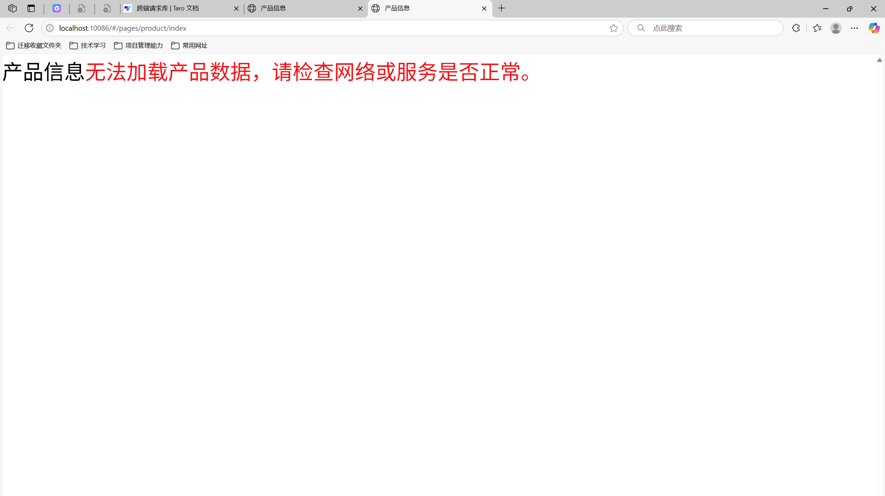
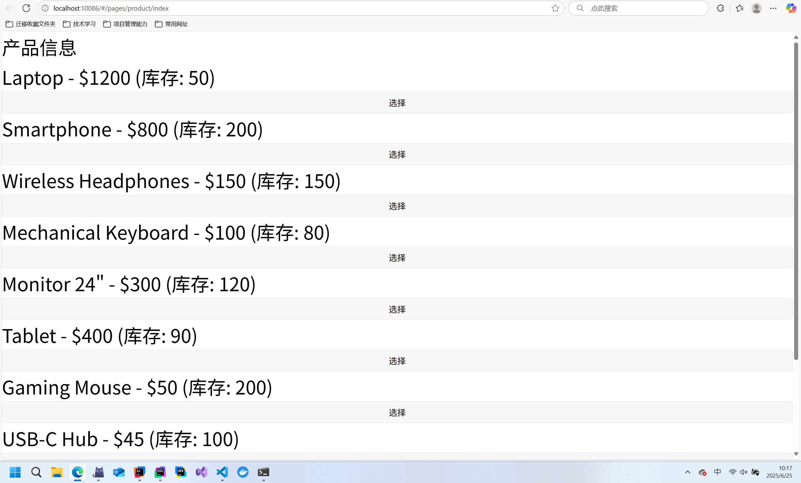
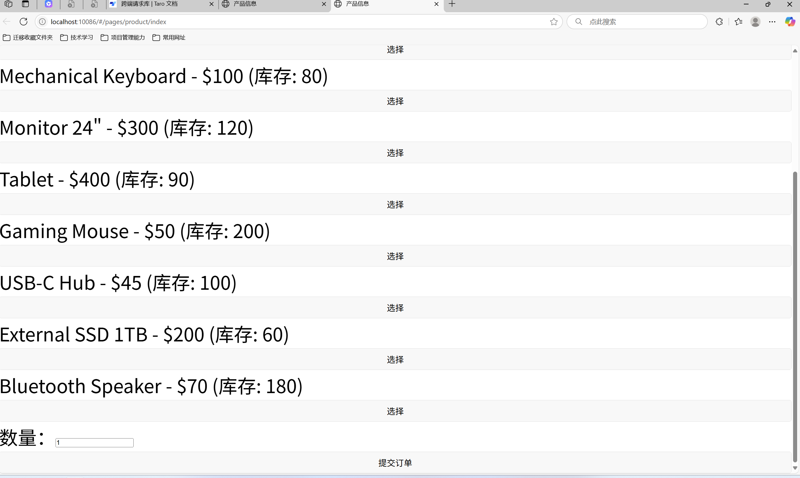
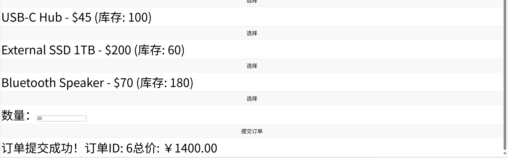
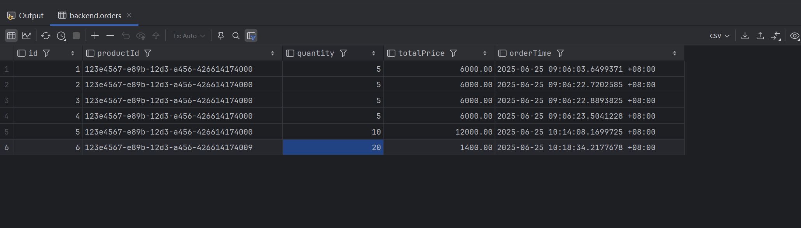

# 使用pnpm 安装依赖
```
npm install -g pnpm & pnpm install
```
# 运行项目
使用pnpm dev:h5 运行项目
```
pnpm dev:h5
```

# UAT情况
## 项目启动时，无网络或后端未启动时，页面显示网络错误


## 后端启动后刷新页面加载到产品数据


## 在选择产品后，页面最下方会显示出数量输入框，和提交订单按钮


## 点击提交订单，显示提交成功 


## 查询数据库，20数量已经被添加 
